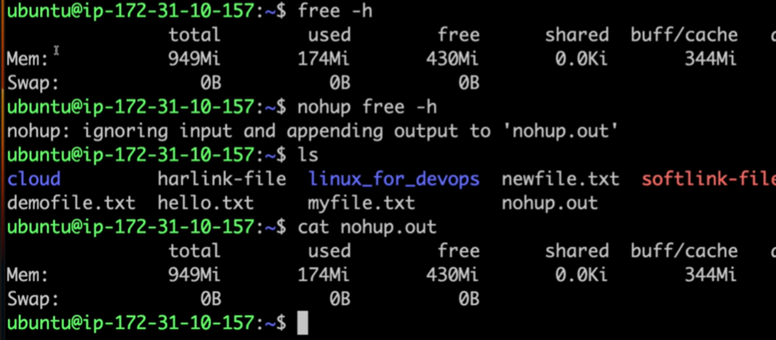
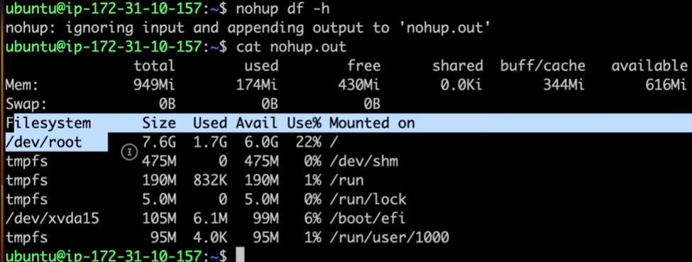

Linux Command Reference Guide

Welcome to the Linux Command Reference Guide! This guide is designed to help you quickly find essential Linux commands, categorized for your convenience. Whether you're a beginner or an advanced user, this quick reference will assist you in managing files, navigating the system, and monitoring your processes with ease.

📁 File Operations:

1. rmdir - Remove an empty directory
           rmdir directory_name
             
2. rm -r - Remove a directory and its contents recursively
           rm -r directory_name

3. cp - Copy files or directories
        cp folder/file_name source_folder
        cp -r /path/to/source/ /path/to/destination/  # Copy a directory

4. mv - Move or rename files
        mv file.txt /path/to/destination/  # Move file
        mv oldfile.txt newfile.txt  # Rename file

5. rm - Remove files
        rm file.txt

📜 Viewing and Manipulating File Content:

1. cat - View the content of a file
         cat file.txt

2. echo - Write content to a file (or create a new one)
          echo "hello" > file.txt  # Creates or overwrites the file

3. zcat - View the content of a compressed (zip) file
          zcat file.gz

4. head - View the first 10 lines of a file
          head file.txt

5. head -n 5 - View the first 5 lines of a file
               head -n 5 file.txt

6. head -c 100 - View the first 100 bytes of a file
                 head -c 100 file.txt

7. tail - View the last 10 lines of a file
          tail file.txt

8. tail -f - Monitor logs in real-time
             tail -f /var/log/syslog  # Continuously monitor log file

9. less / more - View content one screen at a time. 
                 less allows both forward and backward navigation. more only allows forward navigation.

                less file.txt  # Use to view file content
                less -N file.txt  # View file with line numbers
                less -S file.txt  # Disable line wrapping

                more file.txt  # Simpler, forward-only navigation

🔗 File Links:

1. Hard Link: A hard link creates another reference to the same inode (data). Deleting a hard link doesn't remove the actual       data until all hard links are deleted.

              ln file.txt file_hardlink.txt

2. Soft Link (Symbolic Link): A symbolic link (symlink) points to a file's path. Deleting the original file will "break" the symlink.

              ln -s file.txt file_symlink.txt

📝 Text Processing:

1. cut - Extract specific characters/bytes from each line
         cut -b 1-4 file.txt  # Extract bytes
        cut -c 1 file.txt    # Extract specific character

2. tee - Display and save command output to a file
         echo "hello Linux" | tee Linux.txt
         echo "hello Python" | tee -a Linux.txt  # Append to file

3. sort - Sort the lines of a file
          sort file.txt           # Sort alphabetically
          sort -n numbers.txt     # Sort numerically
          sort -k 2 file.txt      # Sort by column 2

4. diff - Compare two files line by line
          diff file1.txt file2.txt  # Show differences between two files

5. wc (Word Count) - Count lines, words, characters, or bytes in a file
                     wc -l file.txt   # Count lines
                     wc -w file.txt   # Count words
                     wc -c file.txt   # Count characters
                     wc file.txt      # Count lines, words, and characters

🔧 System Operations:

1. pwd - Print the current working directory

2. df -h - Display disk space usage (human-readable)

3. du -h - Estimate disk space usage of files or directories
   du .   # Check current directory space usage

4. ps - Display process status
   ps -e   # List all running processes
   ps -f   # Show full format listing of processes

5. top - Real-time view of system processes

6. fuser - Identify processes using a particular file or socket
           fuser /path/to/file

7. kill - Send a signal to a process (terminate it)
   kill PID       # Terminate process by PID
   kill -9 PID    # Forcefully terminate process

8. free - Display system memory usage
   free -h

9. nohup - Run commands immune to hangups
           
           

💻 Virtual Memory and System Information:

1. vmstat - Display system memory, processes, paging, and CPU activity
            vmstat          # Basic system stats
            vmstat 1        # Update every second
            vmstat -s       # Show system summary