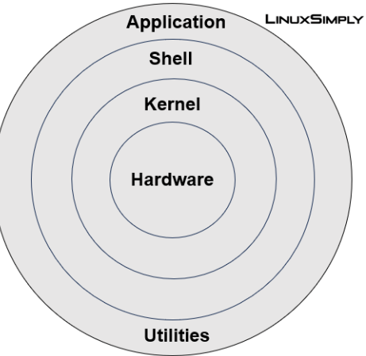
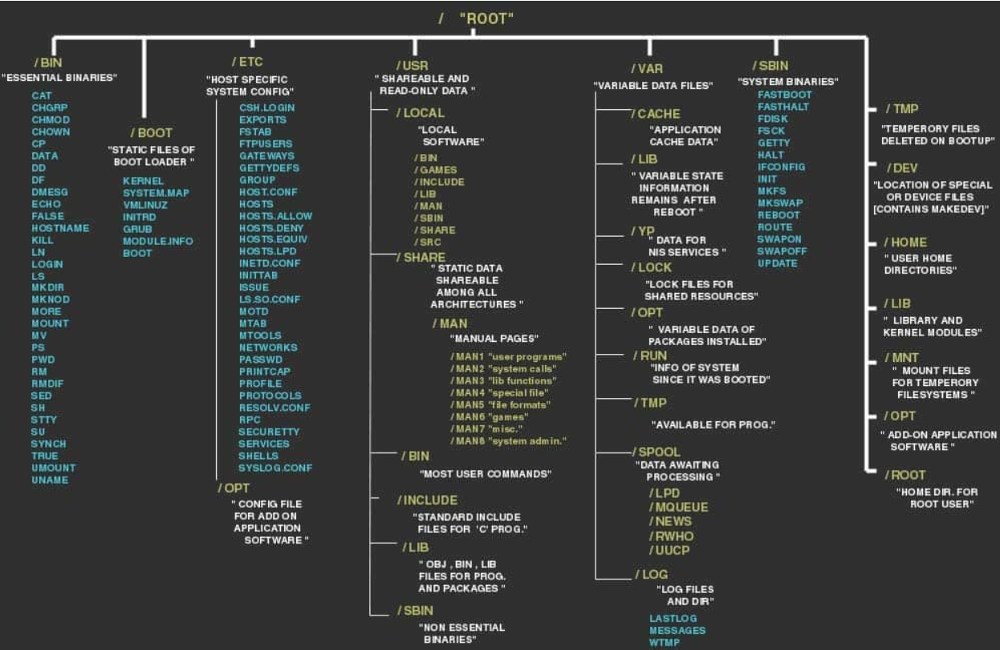

# Linux Basics – A Beginner's Guide

## 📑 Table of Contents
1. [What is Linux? Introduction to Linux Operating System (OS)](#-1-what-is-linux)  
2. [How to Install Linux?](#-2-how-to-install-linux)  
3. [How to Download & Install Linux (Ubuntu) on a Windows PC?](#-3-how-to-download--install-linux-ubuntu-on-a-windows-pc)  
4. [Difference Between Linux and Windows](#-4-difference-between-linux-and-windows)  
5. [Software Remote Location Server Tools](#-5-software-remote-location-server-tools)  
6. [What are Kernel, Bootloader, and Shell?](#-6-what-are-kernel-bootloader-and-shell)  
7. [Desktop Environment](#-7-desktop-environment)  
8. [Linux System Architecture](#-8-linux-system-architecture)  
9. [Information About Hardware](#-9-information-about-hardware)  
10. [Linux File System](#-10-linux-file-system)  
11. [Difference Between Linux and Unix](#-11-difference-between-linux-and-unix)  
12. [States of Processes in Linux](#-12-states-of-processes-in-linux)  
13. [Conclusion](#-conclusion)  
14. [Resources](#-resources)  

---

## 📌 1. What is Linux?
Linux is an **open-source operating system (OS)** based on **Unix**.  
It is widely used in servers, desktops, mobile devices, and embedded systems.  
Key features:  
- Free and open-source.  
- Secure and stable.  
- Highly customizable.  
- Used in most modern servers and cloud systems.  

---

## 📌 2. How to Install Linux?
Linux can be installed in different ways:  
- Directly on a computer as the main operating system.  
- Alongside Windows (dual boot).  
- Inside a virtual machine (using VirtualBox/VMware).  
- On cloud platforms (AWS, Azure, GCP).  

---

## 📌 3. How to Download & Install Linux (Ubuntu) on a Windows PC?
There are multiple ways to run Ubuntu on a Windows system without fully replacing Windows.
Here are the recommended methods:

1. WSL (Windows Subsystem for Linux)
•	Run Linux directly inside Windows without a virtual machine.
•	Install Ubuntu easily from the Microsoft Store.
•	Best for developers who want Linux tools alongside Windows apps.
•	Quick setup:
                wsl --install

2. VirtualBox
•	Install Oracle VirtualBox and create a virtual machine (VM).
•	Let you run Ubuntu as a guest OS inside Windows.
•	Great for safe learning, testing, and experimenting with Linux.

3. Cloud Platforms (AWS, Azure, GCP)
•	Create and run Ubuntu servers on cloud providers like AWS EC2, Azure VM, or Google Cloud Compute Engine.
•	Ideal for practicing Linux server administration and DevOps.
•	Offers real-world server experience.

4. Vagrant
•	A developer-friendly tool to set up and manage Linux environments quickly.
•	Works with VirtualBox, VMware, and other VM providers.

## 📌 4. Difference Between Linux and Windows  

| Feature           | Linux                           | Windows                     |
|-------------------|--------------------------------|-----------------------------|
| Cost              | Free & Open-source             | Paid (licensed)             |
| Security          | More secure (less malware)     | More vulnerable             |
| Customization     | Highly customizable            | Limited                     |
| Performance       | Lightweight and fast           | Requires more resources     |
| Usage             | Servers, Developers, Sysadmins | Home & business users       |

---

## 📌 5. Software Remote Location Server Tools
Linux provides several tools to **remotely connect and manage servers**:  
- **SSH (Secure Shell)** → Connect to servers securely.  
- **Telnet** → Legacy tool (not secure).  
- **VNC / RDP** → Remote desktop access.  
- **SCP / SFTP** → File transfer between systems.
- **AnyDesk** → Free for personal use, paid plans for businesses.

---

## 📌 6. What are Kernel, Bootloader, and Shell?
- **Kernel** → The core of the OS that manages hardware and system resources.  
- **Bootloader** → The program that loads the OS when the system starts. 
                  ( GRUB (Grand Unified Bootloader) is a widely used boot loader in the Linux® world. It's the initial program that kicks into action when you power on your computer, responsible for loading the operating system kernel into memory. )
- **Shell** → Interface between the user and the OS (e.g., Bash). 
                        
---

## 📌 7. Desktop Environment
A **desktop environment (DE)** provides the graphical interface (GUI) of Linux.  
Examples:  
- **GNOME**  
- **KDE Plasma**  
- **XFCE**  
- **Cinnamon**  

---

## 📌 8. Linux System Architecture
Linux is structured in layers:  
1. **Hardware** → CPU, RAM, storage, etc.  
2. **Kernel** → Manages hardware & system resources.  
3. **System Libraries** → Provide functions for applications.  
4. **System Utilities** → Core commands (cp, mv, ls, etc.).  
5. **User Applications** → Software installed by users.  
                        

---

## 📌 9. Information About Hardware
Linux provides commands to check system hardware:  
- `lscpu` → CPU details.  
- `lsblk` → Storage details.  
- `free -h` → RAM usage.  
- `lspci` → PCI devices.  
- `lsusb` → USB devices.  

---

## 📌 10. Linux File System
- Linux uses a **hierarchical file system** starting with the root (`/`).  

---

## 📌 11. Difference Between Linux and Unix  

| Aspect        | Linux                         | Unix                          |
|---------------|-------------------------------|-------------------------------|
| Source Code   | Open-source                   | Mostly proprietary            |
| Cost          | Free                          | Commercial (paid)             |
| Hardware      | Runs on almost any hardware   | Limited hardware support      |
| Development   | Community-driven              | Developed by specific vendors |

---

## 📌 12. States of Processes in Linux
A process in Linux can be in different states:  
- **Running (R)** → Actively using CPU.  
- **Sleeping (S)** → Waiting for resources.  
- **Stopped (T)** → Suspended by user.  
- **Zombie (Z)** → Process finished but entry remains in process table.  

---

## ✅ Conclusion
Linux is powerful, stable, and secure, making it a top choice for developers, sysadmins, and businesses.  
This guide gives a **basic overview** to help you understand Linux fundamentals.

---

## 📖 Resources
- [Linux Command Handbook] https://www.freecodecamp.org/news/the-linux-commands-handbook/

